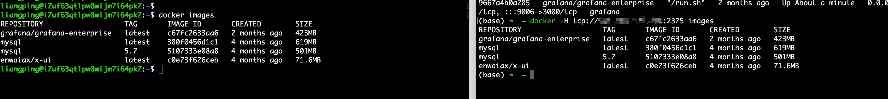

## install docker package
```
pip install docker
```
## 配置docker dameon host
> **如果访问的是本机的docker server，不需要该步骤**，该步骤主要是为了允许docker engine 外部访问
按照官网的[configuring-remote-access-with-daemonjson](https://docs.docker.com/config/daemon/remote-access/#configuring-remote-access-with-daemonjson)文档操作我这边docker重启失败了，通过命令 `sudo journalctl -eu docker` 可以看到失败的日志，通过搜索日志，发现了[Troubleshoot conflicts between the daemon.json and startup scripts](https://docs.docker.com/config/daemon/troubleshoot/)该文档，问题最终得到了解决。

主要配置步骤如下：
``` shell
# 如果文件夹已存在，则不需要重复创建
sudo mkdir  /etc/systemd/system/docker.service.d
```
```shell
sudo vi /etc/systemd/system/docker.service.d/docker.conf
```
将下面的内容copy进去
```
[Service]
ExecStart=
ExecStart=/usr/bin/dockerd -H fd:// -H tcp://0.0.0.0:2375
```
Reload the systemctl configuration
```shell
sudo systemctl daemon-reload
```
Restart Docker.
```shell
sudo systemctl restart docker.service
```
Verify that the change has gone through.
```
liangping@iZuf63qtlpw8wijm7i64pkZ:~$ sudo netstat -lntp | grep dockerd
tcp        0      0 127.0.0.1:2375          0.0.0.0:*               LISTEN      1913118/dockerd 
```
按照以上步骤操作完后，就可以支持远程访问了docker engine了  

或者通过设置环境变量的方式访问


## python使用docker sdk
> 下面举个简单例子，更多用法可以直接参考官方文档
```python
import docker
# client = docker.from_env()  # use local docker
# custom other docker daemon server
client = docker.DockerClient(base_url='tcp://{ip}:2375')
container = client.containers.run("alpine", ["echo", "hello", "world"], name='test', remove=True)
print(client.containers.list(all=True))
```


## 相关文档
- [docker sdk](https://docs.docker.com/engine/api/sdk/)
> 文档中docker engine 默认的都是本地的，如果要使用其他机器的docker engine，要进行相关设置，设置可以看 [docker daemon host](https://docs.docker.com/config/daemon/remote-access/)
- [docker sdk for python](https://docker-py.readthedocs.io/en/stable/client.html)
- [docker daemon host](https://docs.docker.com/config/daemon/remote-access/)
- [Troubleshoot conflicts between the daemon.json and startup scripts](https://docs.docker.com/config/daemon/troubleshoot/)
- [dockerd](https://docs.docker.com/reference/cli/dockerd/)