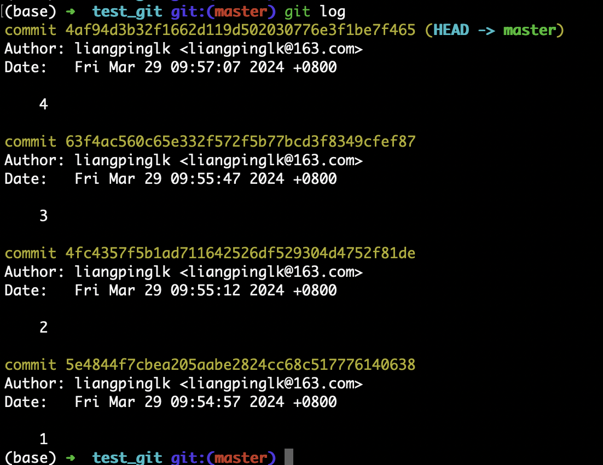
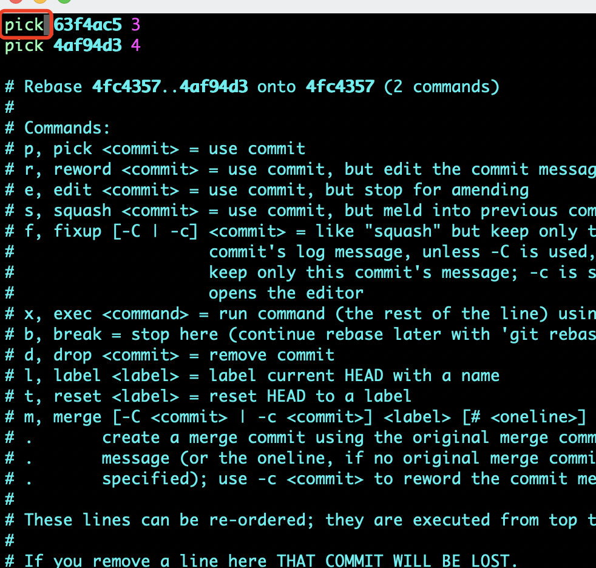
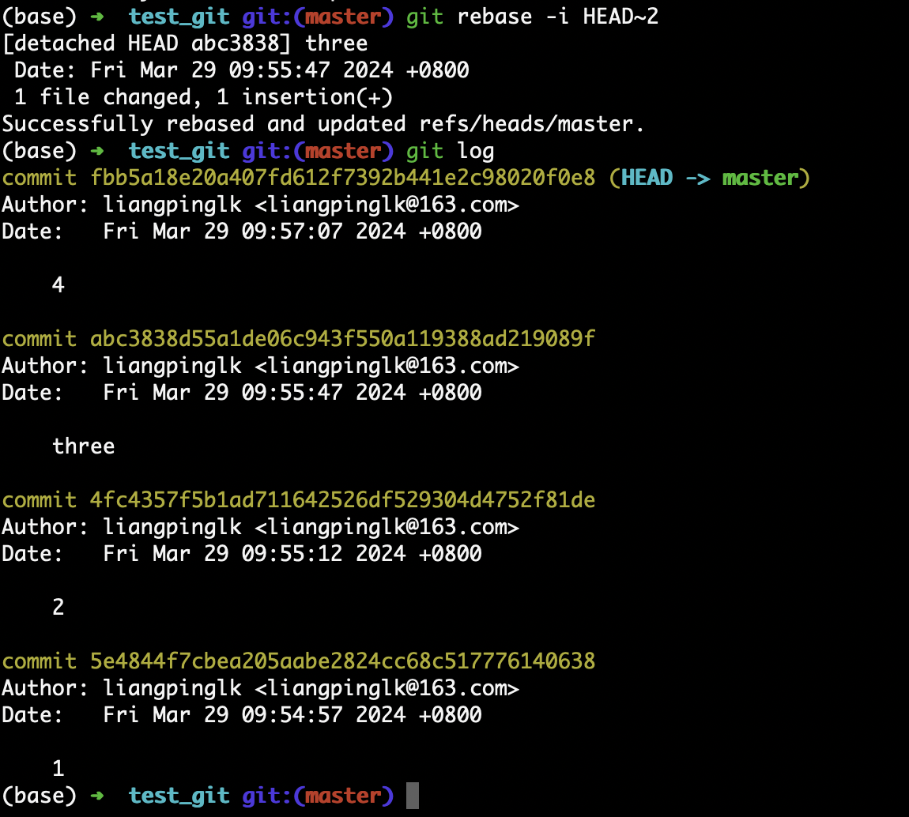
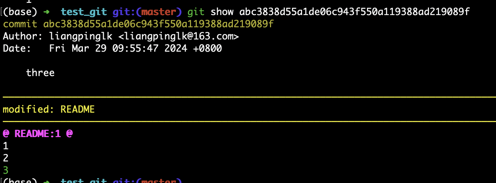
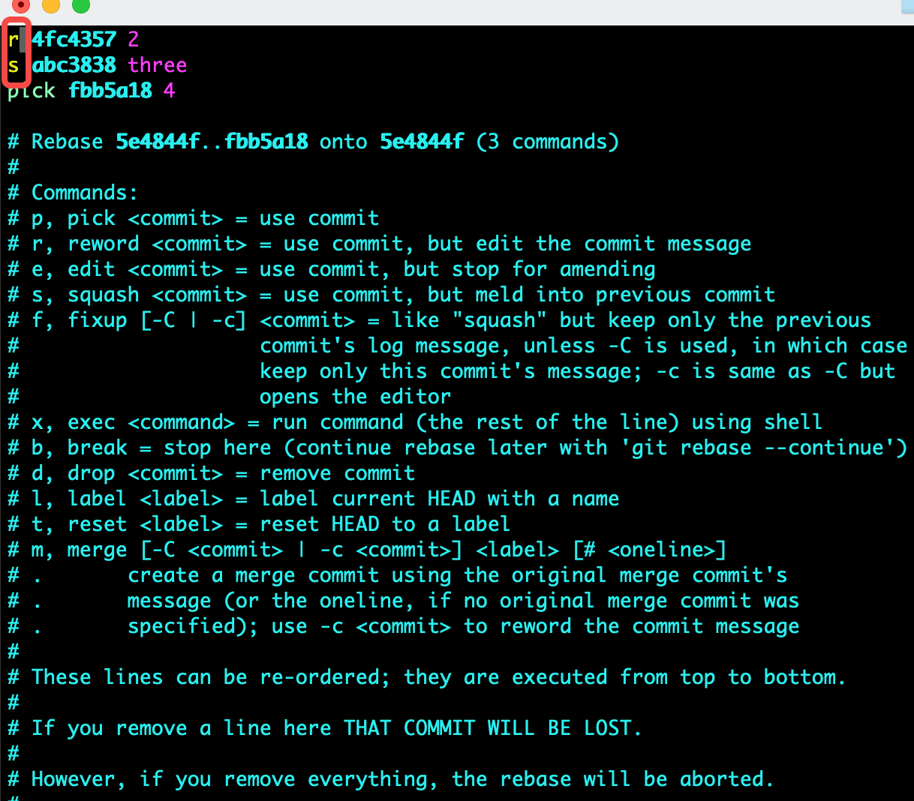
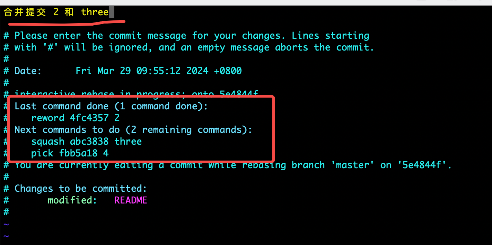
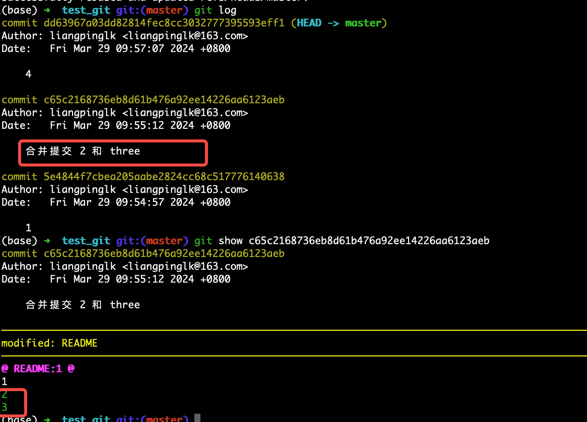

## git rebase 

### 修改某次提交



1.初始仓库如上图，我们修改 提交 ‘3’, 执行命令

> [!TIP]
> 如果要改变第一次的提价内容，那么应该执行命令 ``` git rebase -i --root ```

```
git rebase -i HEAD~2
```

2.弹出如下图，修改pick 为r(reword)，退出并保存  



3.弹出下图commit信息编辑框，将提交内容修改为‘three’，退出并保存  

 

4.修改后的效果如下

 | 
--- | ---


### 合并两次提交
 

1.初始仓库信息如上图，执行命令

```
git rebase -i HEAD~3
```

2.分别修改为r 和 s

 

3.然后保存会弹出编辑框

 

4.编辑后推出，效果如下

 
