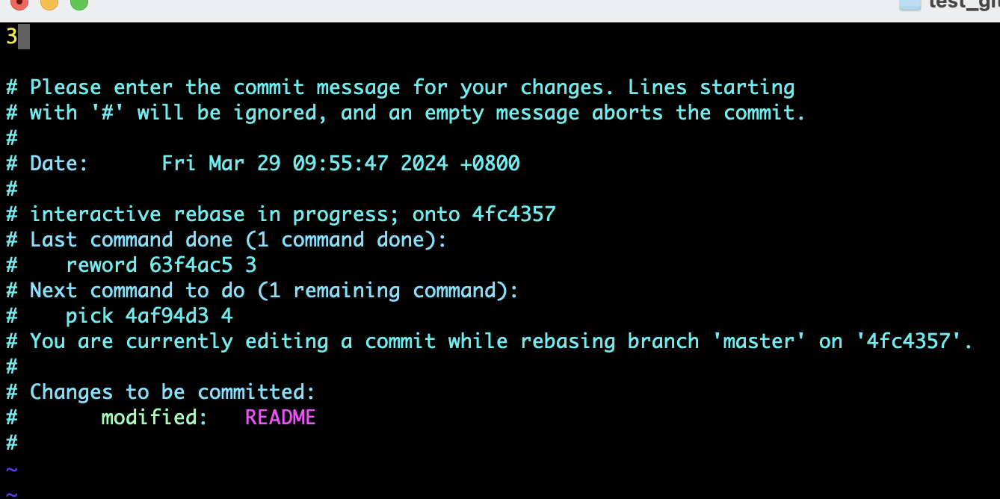

## git rebase 

### 修改某次提交

初始仓库如上图，我们修改 提交 ‘3’, 执行命令
> [!TIP]
> 如果要改变第一次的提价内容，那么应该执行命令 ``` git rebase -i --root ```

```
git rebase -i HEAD~2
```
弹出如下图，修改pick 为r(reword)，退出并保存  
  
弹出下图commit信息编辑框，将提交内容修改为‘three’，退出并保存  
  
修改后的效果如下  
 

### 合并两次提交

初始仓库信息如上图，执行命令
```
git rebase -i HEAD~3
```
分别修改为r 和 s

然后保存会弹出编辑框

编辑后推出，效果如下

