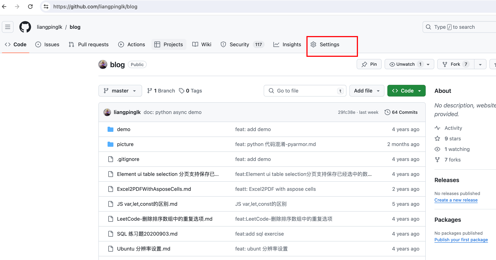
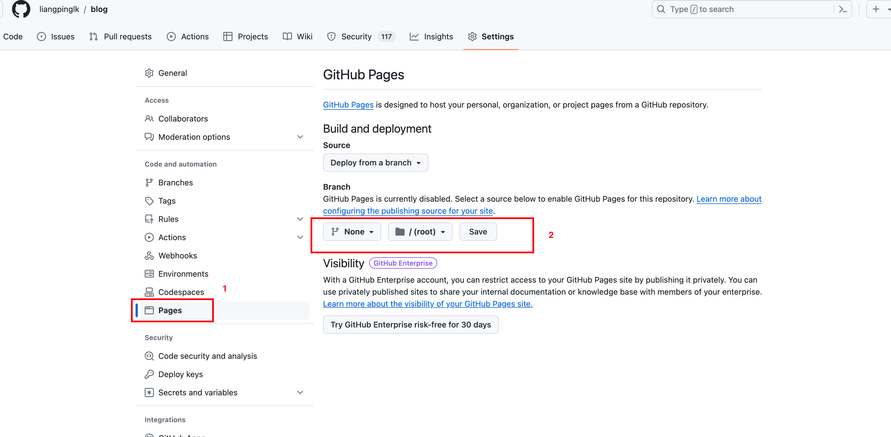

## 使用github pages 部署文档
> 习惯了使用markdown写一些笔记，但是每次阅读时不太方便，之前一直想着找时间搞一下，今天在看openresty best practices 时，发现原来的gitbook链接挂掉了，因此fork了这个项目，搞了个github pages，方便阅读，[openresty-best-practices](https://liangpinglk.github.io/openresty-best-practices/)。正好借此机会，记录下如果使用github pages 部署文档。

记录下从0到1 做一个简单的demo

## 创建仓库
> 不多叙述，用过github的应该都会

## 安装gitbook cli
> node 版本我用的6.14.4，使用[nvm](https://github.com/nvm-sh/nvm)可以方便的管理node版本
```
npm install -g gitbook-cli
```

## 初始化gitbook
进入仓库目录
- 初始化gitbook 项目
如果项目没有 README.md 和 SUMMARY.md 文件，执行命令，自动成功， 如果有了，可以忽略，不用管执行
```
gitbook init 
```

## 配置 SUMMARY.md
example
```
# Summary

* [Introduction](README.md)
* [Chapter 1](chapter1/README.md)
  * [Section 1.1](chapter1/section1.1.md)
  * [Section 1.2](chapter1/section1.2.md)
* [Chapter 2](chapter2/README.md)
  * [Section 2.1](chapter2/section2.1.md)
  * [Section 2.2](chapter2/section2.2.md)
```

## 预览和构建gitbook
```
gitbook serve
```
便可以在本地预览了

## 部署到github pages

### 手动部署到github pages
- 生成静态文件
```
gitbook build
```
- 将生成的 _book 目录内容推送到 gh-pages分支
```
git add -f _book/*
git commit -m "Deploy GitBook to GitHub Pages"
git subtree push --prefix _book origin gh-pages
```

### 自动部署到github pages
使用github action, 创建 .github/workflows/gitbook.yml 文件，并添加以下内容：
```
name: Build and Deploy GitBook

on:
  push:
    branches:
      - master

jobs:
  build:
    runs-on: ubuntu-latest

    steps:
      - name: Checkout repository
        uses: actions/checkout@v2

      - name: Install Node.js
        uses: actions/setup-node@v2
        with:
          node-version: '6.14.4'

      - name: Install GitBook CLI
        run: npm install -g gitbook-cli

      - name: Build GitBook
        run: gitbook build

      - name: Deploy to GitHub Pages
        uses: peaceiris/actions-gh-pages@v3
        with:
          github_token: ${{ secrets.GITHUB_TOKEN }}
          publish_dir: ./_book
```

### 设置github pages
- 点击仓库settings

- 进入settings后，按照图示顺序点击第二步，选定gh-pages分支（没有的话进行创建）


### 访问部署的文档
```
https://{user}.github.io/{repo_name}/
```
比如访问我自己的笔记：
https://liangpinglk.github.io/blog/
