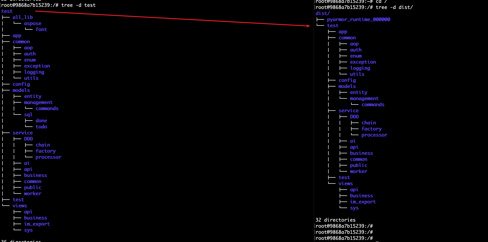
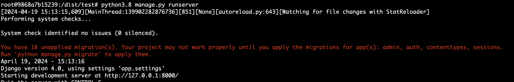

## [pyarmor](https://pyarmor.readthedocs.io/en/stable/tutorial/getting-started.html)
## install
> 这里固定版本是为了避免版本不同导致后面的测试命令发生不兼容的问题
```
pip install pyarmor==8.5.2
```
## 生成混淆后的文件
```
pyarmor g -r test
```
默认在当前目录生成一个dist文件,混淆前与混淆后项目目录结构如下：

## 运行项目
如果我们直接运行会报错
```shell
root@9868a7b15239:/dist/test# python3.8 manage.py runserver
Traceback (most recent call last):
  File "manage.py", line 3, in <module>
    from pyarmor_runtime_000000 import __pyarmor__
ModuleNotFoundError: No module named 'pyarmor_runtime_000000'
```
我们将 `pyarmor_runtime_000000` 目录move到 `test` 项目目录下
```shell
root@9868a7b15239:/dist/test# mv ../pyarmor_runtime_000000 .
```
移动完成后再次执行，就正常了  

最终混淆后的代码的目录结构  

## 代码同步
```
# rsync -av --update /source_folder/ /destination_folder/
rsync -av dist/test/ test/
```
## dockerfile 编译镜像时混淆
```
RUN pyarmor g -O /dist -r /project
RUN mv /dist/pyarmor_runtime_000000  /project/ && rsync -av /dist/project/ /project/
```
